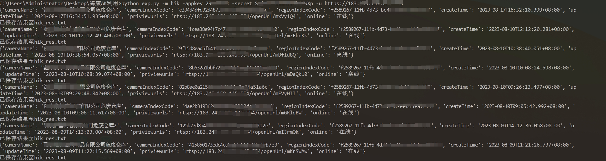
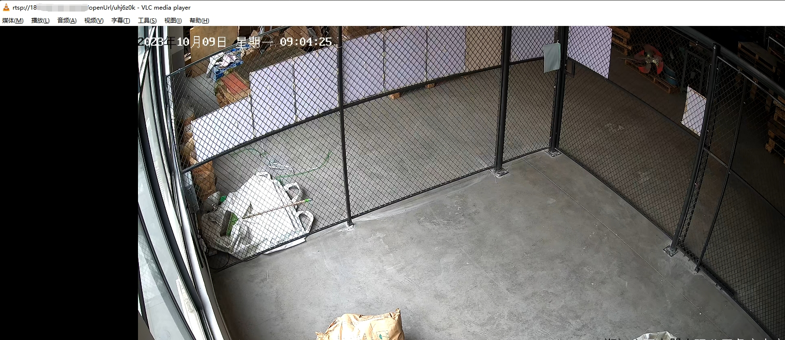
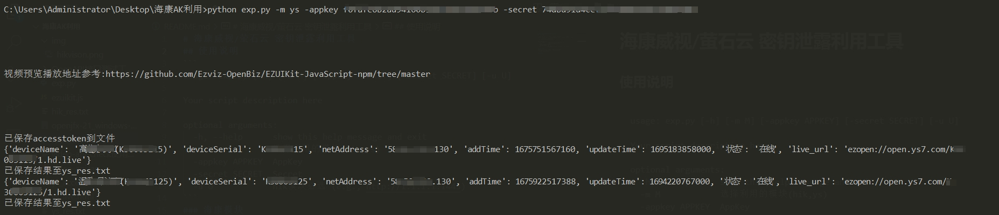
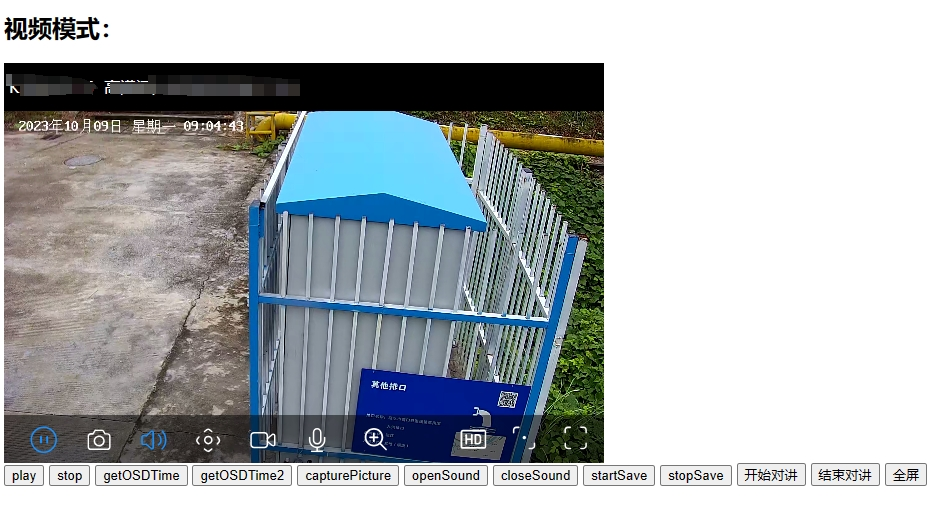

# 海康威视/萤石云 密钥泄露利用工具

现在遇到海康和萤石泄露的例子越来越多，这工具能快速的给甲方爸爸证明危害或者在hvv中提高工作效率。
## 使用说明
```
python exp.py -h
usage: exp.py [-h] [-m M] [-appkey APPKEY] [-secret SECRET] [-u U]

Your script description here

optional arguments:
  -h, --help      show this help message and exit
  -m M            选择利用的模块(hik,ys)
  -appkey APPKEY  AppKey
  -secret SECRET  Secret
  -u U            hik模块必选 (e.g., http://1.1.1.1:1443)
```
### 海康模块
具体效果看图，返回的预览链接可以用vlc直接观看



### 萤石云
萤石云的预览协议用的是ezopen，兼容性最好，其他协议测试了效果太不理想。

播放工具也是萤石官方给的demo，只需要在html的js中修改accesstoken和直播url即可。


